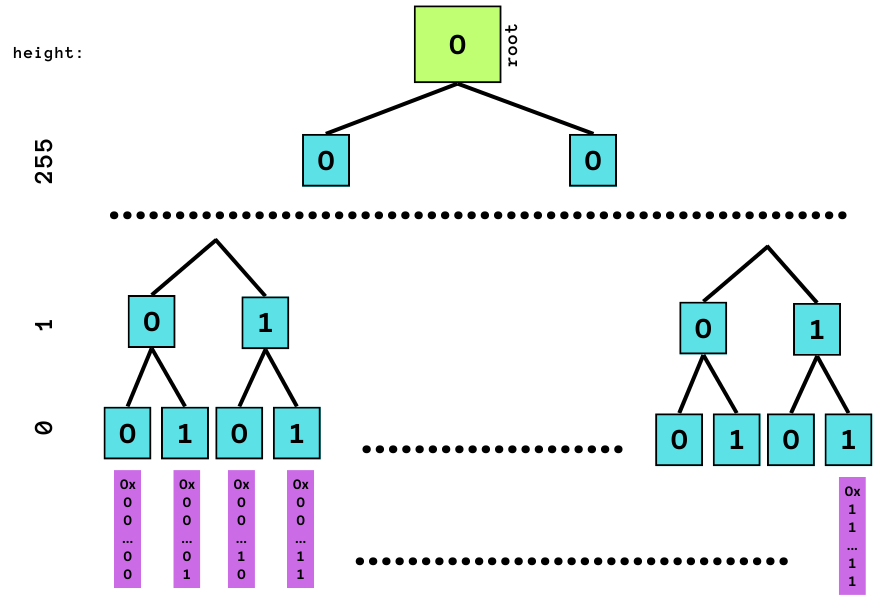
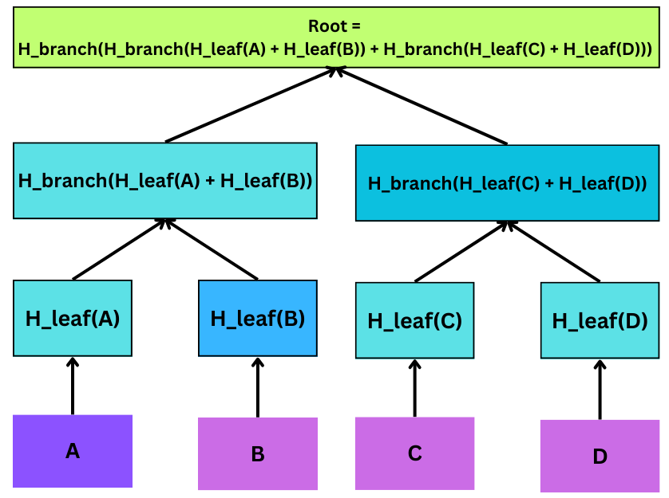
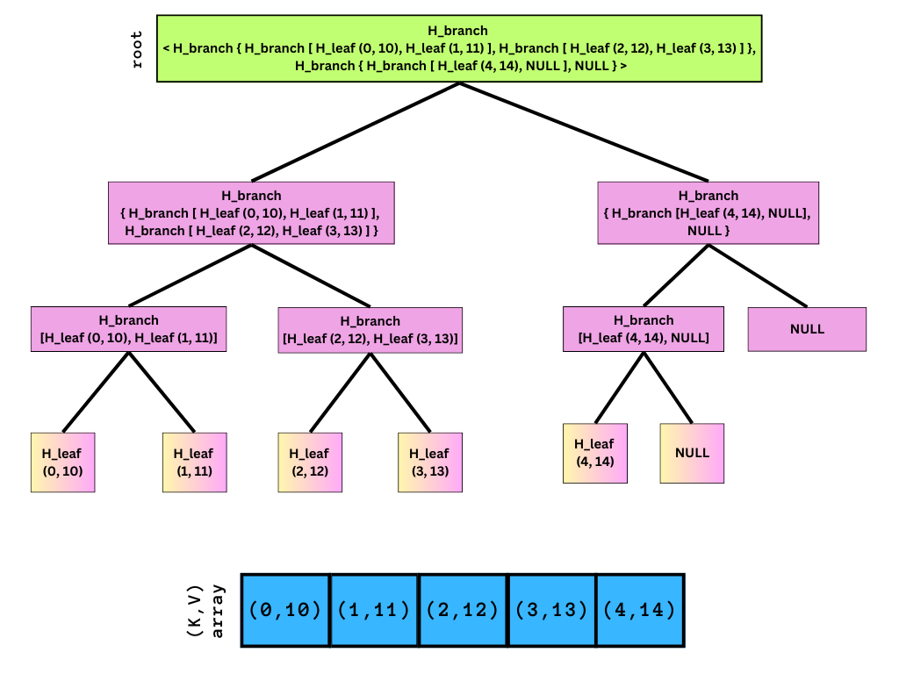
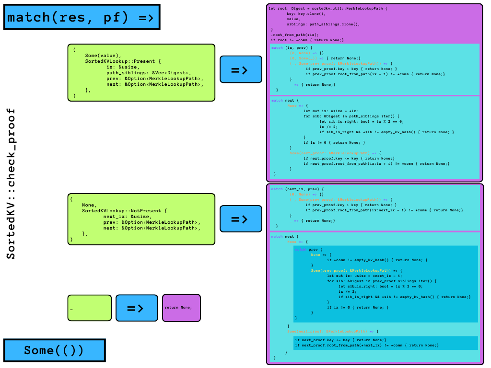

## 🌴 a sparse merkle tree library from scratch


<br>

<p align="center">

</p>

<br>


### ✨ theoretical background

<br>

#### authenticated data structures

<br>

an *authenticated data structure* (ADS) is an advanced data structure on which an untrusted prover can query for an entry, receiving a result and a proof so that the response can be efficiently checked for authenticity.

<br>


> according to [Miller et al](https://www.cs.umd.edu/~mwh/papers/gpads.pdf), *"an authenticated data structure (ADS) is a data structure whose operations can be carried out by an untrusted prover, the results of which a verifier can efficiently check as authentic. this is done by having the prover produce a compact proof that the verifier can check along with each operation’s result. ADSs thus support outsourcing data maintenance and processing tasks to untrusted servers without loss of integrity."*

<br>


<p align="center">

</p>


<br>


authenticated data structures can be thought as cryptographic upgrades of the classic algorithms we are used to (such as hash maps, binary trees, or tries), with an extra operation added to `insert()`, `lookup()`, `delete()`, `update()`: the `commit()`. in other words, ads add two extra features to traditional data structure:

* i. you can calculate a "commitment" of the data structure (a small, unique cryptographic representation of the data structure),
* ii. queries about the data structure can provide a "proof" of their results, which can be checked against the data structure's digest.

naturally, the properties of an ads rely on standard cryptographic assumptions (e.g., no one can invert or find collisions in a particular cryptographic hash function).

in addition, commitments must uniquely determine the data structure's value, *i.e.*, if `a.commit() == b.commit()`, then `a == b`. but "equal" data structures may not always have equal commitments. depending on what `a == b` means, there may be two data structures `a` and `b` where `a == b` but `a.commit() != b.commit()`. for example, an array can be used to represent a set, but there are many arrays that can represent the same set.

finally, proofs for queries must be complete and sound. completeness means that every valid query result has a valid proof. soundness means that valid proofs imply that the query results are correct (i.e., if `r` is a result for a query `q`, with a proof `pf` and with `check_proof(r,pf,ads.commit())` returning `True`, then `ads.run_query(q) == r`.

<br>


#### cryptographic hash functions


a *cryptographic hash function* `H` is a special function that takes an arbitrarily long sequence of bytes and returns some fixed-size "digest" of that sequence. cryptographic hash functions have two special properties for our purposes:

- preimage resistance: given a digest `d`, it's infeasible to calculate a
  string `s` such that `H(s) = d`.
- collision resistance: it's infeasible to find two strings `s1` and `s2`
  such that `H(s1) == H(s2)`.

for this library, we will be using the `SHA-256` hash function, which has a 256-bit digest.

<br>


#### authenticated key-value stores


an authenticated key-balue store is an ADS of an "associative array" or "map". the methods of the data structure are described in `src/kv_trait.rs`:

```rust
fn new() -> Self;
fn commit(&self) -> Self::Commitment;
fn check_proof(key: Self::K, res: Option<Self::V>, pf: &Self::LookupProof,
        comm: &Self::Commitment) -> Option<()>;
fn insert(self, key: Self::K, value: Self::V) -> Self;
fn get(&self, key: Self::K) -> (Option<Self::V>,Self::LookupProof);
fn remove(self, key: Self::K) -> Self;
```

<br>

note that `insert()`, `get()`, and `remove()` behave like the same methods in `std::collections::HashMap`, except that `insert()` and `remove` return copies of the ADS rather than taking `&mut self`.

<br>


#### understading sparse merkle trees

<br>


**merkle trees** are the canonical and original example of an **authenticated data structure**, designed for **easy inclusion proofs** but not **exclusive proofs** (*e.g.*, a prover can efficiently convince the verifier that a particular entry is present but not absent). in addition, since **inserting at a specific position cannot be done efficiently** (as the whole tree would need to be recomputed), these trees are unsuitable for authenticated key-value maps.

**sparse merkle trees**, on the other hand, provide **efficient exclusion proofs** by design. they can be built on a key-value map, where each possible `(K, V)` entry corresponds to a unique leaf node and is linked to its position in the tree. due to the **history independence** of the merkle root from element insertion order, sparse merkle trees are the suitable choice to authenticate key-value maps.


<br>


##### representing `(K, V)` pairs as leaf nodes

<br>


in a sparse merkle tree, a particular `(K, V)` is represented by the leaf node and its path from the root encoded by its hash digest. 

leaf nodes should allow every possible value of the cryptographic hash function to map a `(K, V)` value (through a `H_leaf(K, V)`). Therefore, if the function is represented by `N` bits, the tree's height is `N`, and the paths down to the `2^N` leaf nodes are represented by (`N`-nodes-deep) bit-strings. When the `(K, V)` entry is not present in the map, an empty leaf is assigned (for instance, with an all-`0` digest).


in the case of SHA-256, the tree has a height of `256` and `2^{256}` leaf nodes represented by `256-bit` paths.


<br>


##### internal nodes

<br>


branch nodes have left and right subtrees given by the digest of its child subtrees digest (something like `H_branch(Digest, Digest)`, a concatenated hash of its child nodes). note that different hash functions should be used for leaf and branch nodes to prevent [preimage attacks](https://en.wikipedia.org/wiki/Preimage_attack).


each child subtree position is found by looking at the bits of `H(K)`. a left branch is denoted as `0` and a right branch as `1`, so the most left leaf's key is `0x000..00`, the next is `0x00..0`, the most right key is `0x11..11`, and so on.

most leaf nodes are empty, and the hashes of empty nodes are identical. the same is true for interior nodes whose children are all empty: subtrees with no leaf nodes are represented as an empty subtree with a digest such as the all-`0` digest.


<br>


##### the root node

<br>

parent branch nodes are obtained by hashing together two child nodes recursively until the top to the merkle root of the tree. 

the root hash is the commitment of the tree. rhis value is either digest of the root node (either all-`0` digest or a `H_branch()` function). 


<br>

<p align="center">

</p>


<br>


##### space complexity


<br>

to naively create a sparse merkle tree, one can generate all possible `2^N` outputs of the hash function as a leaf in the tree and initialize them to the empty value. this generates a nearly unbounded number of data.

since required storage is only proportional to the number of items inserted into the tree, some optimizations are possible:

  - items on the leaf node are initially `None` and, therefore, do not need to be stored.
  - subtrees with no leaf nodes are represented as "empty subtree", with an all-`0` digest.
  - internal nodes all have fixed predictable values that can be re-computed as hashes of `None` values.

therefore, a sparse merkle tree can simply store a set of leaf nodes for the `(K, V)` pairs plus a set of empty hashes representing the sparse areas of the tree.


<br>

##### performance


<br>


a sparse merkle is nearly balanced. if there are `N` entries in the tree, a particular entry could be reached in `log2(N)` steps.


<br>

##### how do we know that each key is in a unique leaf?

<br>

each leaf is a unique representation of the `2^N` possibilities presented by the digest size `N` of the cryptographic hash function.

since cryptographic hash functions (or, in particular, SHA-256) are expected to be collision resistant (*i.e.,* it's infeasible to find two strings `s1` and `s2` such that `H(s1) == H(s2)`), each key is in a unique leaf.


<br>


##### which hash function assumption does represent the empty subtree by the all-`0` digest rely upon?

<br>

the deterministic/predictable characteristics of one-way hash functions. 

in other words, `H(0)` is a constant value, and so `H(H(0))`, `H(0, 0)`, `H(H(0, 0))`, etc.

(and big chunks of the tree can be cached).

<br>


##### suppose two sparse merkle trees differ in exactly one key, but their digests are the same. Why does this break collision resistance?

<br>

even if the two keys differ by exactly one key, their digest should be completely different. 

if that's not the case, the collision resistance assumption of the cryptographic function is broken (*i.e.,* "it's infeasible to find two strings `s1` and `s2` such that `H(s1) == H(s2)`.")

<br>

---

### ✨ diving into the source code

<br>

#### on `SortedKV::check_proof()`

<br>


<p align="center">
</p>


<br>


the first authenticated data structure we review, `AuthenticatedKV::SortedKV`, is a sorted key/value store represented by a vectorial abstraction of a (unbalanced) binary tree (*i.e.*, the underlying data structure is an array).


although the key sorts the structure, it's not a binary search tree, and it allows repeated entries. rather, the structure's commitment is an overall hash calculated recursively as a binary tree. ehis digest is obtained by mapping the merkle hash of each pair (named "merkle mountain range").


<br>


```rust
pub struct SortedKV {
    commitment: Digest,
    store: Vec<(String, String)>,
}

impl SortedKV {
    fn binary_search(&self, key: &str) -> usize {
        let (mut lo, mut hi) = (0, self.store.len());
        while lo + 1 < hi {
            let mid = lo + (hi - lo) / 2;
            if self.store[mid].0.as_str() <= key {
                lo = mid;
            } else {
                hi = mid;
            }
        }
        assert_eq!(lo + 1, hi);
        lo
    }
}

impl AuthenticatedKV for SortedKV {
  type K = String;
  type V = String;
  type LookupProof = SortedKVLookup;
  type Commitment = Digest;

  fn new() -> Self;
  fn commit(&self) -> Commitment;
  fn check_proof(key: K, res: Option<V>, pf: &LookupProof, comm: &Commitment,)
                                                                         -> Option<()>;
  fn insert(self, key: K, value: V) -> Self;
  fn get(&self, key: K) -> (Option<V>, LookupProof);
  fn remove(self, key: K) -> Self;
```

<br>


#### on `SortedKV::check_proof` 


<br>

the `check_proof()` method is an extensive `match(res, proof)` control flow operator that checks against a (complete) set of failure or inconsistency possibilities for:

1. a query result (`res`),  matching on `Some(value)` or `None`, and 
2. the associated proof (`pf`) for this result, encoded as two possible states of `enum SortedKVLookup`:

<br>

```rust
pub enum SortedKVLookup {
    NotPresent {
        next_ix: usize,
        prev: Option<MerkleLookupPath>,
        next: Option<MerkleLookupPath>,
    },
    Present {
        ix: usize,
        path_siblings: Vec<Digest>,
        prev: Option<MerkleLookupPath>,
        next: Option<MerkleLookupPath>,
    },
}
```

<br>

this structure for the proof contains all the information needed to build the tree up to this point:

- if a value is `Present` in result, it provides a pointer to `(k, v)`, the full information about the `prev` and the `next` elements (encoded by `MerkleLookupPath`), and an array with the digest of all siblings. 
- if a value is `NotPresent` in result, it provides the pointer for the next `ix`, and the full information about the `prev` and the `next` elements (encoded with `MerkleLookupPath`).

<br>

```rust
pub struct MerkleLookupPath {
  pub key: String,
  pub value: String,
  pub siblings: Vec<Digest>,
}
```

<br>

with `match(res, pf)`, the proof's correctness for the given result is checked by excluding any possibilities of breaking the proof's properties (instead of being around what a specific hash function or cipher is). this is a consistent mathematical approach that allows generalization.

<br>

<p align="center">
</p>

<br>


anything that breaks any properties for proof and result properties is returned as `None`. in fact, there are 18 `return None` statements through its entire scope, so that only if all sub-scope checks pass, `Some(())` is the `Optional<()>` return.


<br>


#### matching on `(res, pf) = (Some(value), Present)`

<br>

the first matching case is for a non-empty query result:

<br>

##### 1. asserting that the digest is equal to the structure's commitment

checks if the tree's commitment (*i.e.,* `Self::Commitment`, the digest string of the sorted authenticated data structure) can be reproduced with the proof's `path_siblings` array for the given `ix` through `sortedkv_util:::root_from_path()`:

<br>

```rust
impl MerkleLookupPath {
  pub fn root_from_path(&self, ix: usize) -> Digest {
    root_from_path(ix, &self.siblings, &self.key, &self.value)
  }
}
```

<br>

this returns the overall digest hash of the tree with `(k, v)` at a leaf pointer `ix`, with all the sibling hashes `path`. the calculation consists of iterating to each sibling in the array of siblings' digests, attributing the hashes for left and right sub-trees, and then iteratively hashing them. 

although there are multiple representations of an associative array, a general rule for the indexing representation is that:
- a right sibling can be found through `2 * ix + 2`, so `(ix % 2 == 0) == true`, and 
- a left sibling can be found through `2 * ix + 1`,  so `(ix % 2 == 1) == true`.


<br>

```rust
let mut running_hash = hash_kv(k, v);
for sib in path.iter() {
  let sib_is_right = ix % 2 == 0;
  ix /= 2;
  let (l, r) = if sib_is_right {
    (running_hash, *sib)
  } else {
    (*sib, running_hash)
  };
    running_hash = hash_branch(l, r);
}
```

<br>

##### 2. checking the relation between `(ix, prev proof)`

for a valid `ix`, the proof of the previous pair must be valid:
- its key must not be larger than the current key (or would break the sorted assumption).
- its commitment digest must match the ads commitment (or would break the authenticated structure assumption).
- if `ix == 0`, the element must be the first in the structure, and the previous proof must be `None`.
- any proof outside of these assumptions is regarded as invalid.

<br>

##### 3. checking the next proof, `next`

for a valid `ix`, the proof of the next pair must be valid:
- if `next == None`, `ix` must be the last element. Without accessing the length of the store, this check is made by ensuring that every right sibling sub-tree is empty.
- the key for `next` must be larger than the element's key.
- the calculated commitment digest for the next element must match the ads commitment.
- any proof outside of these assumptions is regarded as invalid.


<br>


#### matching on `(res, pf) = (None, NotPresent)`

<br>

##### 1. checking the relation between `(next_ix pointer, prev proof)`

<br>

a valid `next_ix` must have a valid previous proof:
- it can't be `None`, unless `next_ix == 0` (in this case, it must be `None`).
- its key must be smaller than the one at `next_ix`.
- the digest calculated with `root_from_path()` must match the ads commitment. 
- any proof outside of these assumptions is regarded as invalid.

<br>

##### 2. checking the next proof, `next`

- if next proof is `None`:
  - if the previous proof is also `None`, the store must be empty, and the commitment must be `empty_kv_hash()`.
  - otherwise, the path for the previous proof must be made of all-empty right siblings (by calculating it through `next_ix - 1`).
- if next proof is a valid, not `None` proof, then its key must be larger than the previous item's key, and the reconstruction of the ads commitment must be correct.
- any proof outside of these assumptions is regarded as invalid.


<br>


#### is `check_proof()` complete?

<br>

> *completeness means that every valid query result has a valid proof.*

<br>

yes, as the `check_proof()` method matches the query result and the proof against a complete set of invalid possibilities.

in addition, every valid or empty query result has a valid proof object built by the method `SortedKV::get()`, which takes a query `k` and returns an `Option<Value>` and a proof:
- first, by returning an all-empty `(None, NotPresent)` object if the store is empty (which would check valid with `match(next_ix, prev) = (0, None)`).
- then, by performing a skewed-to-right binary search, returning a pointer `ix` for the element (if found) or the key position of the rightmost pair with `k <= key` (an index before to where the key should be).
- with this pointer, the proofs for the element (`ix_proof`) and the previous and next elements (`next`, `prev`) are constructed, and a `LookupProof` object is built and returned by (unsafely?) unwrapping `ix_proof`.

note that, similarly to a simple merkle tree, this structure is an example of a *vector commitment*, as the root also authenticates the order of the data in the array.

<br>


#### is `check_proof()` sound?

<br>

> *soundness means that valid proofs imply that the query results are correct. 
if you receive a result `r` for a query `q`, and a proof `pf`, and `check_proof(r, pf, ads.commit())` succeeds, then `ads.run_query(q) == r`.*

<br>

yes, as it relies on `sha2::Digest`, a well-known hash function where collisions are improbable (unless quantum computers). there are `2^{256}` possible `32-byte` hash values when using SHA-256, which makes it nearly impossible for two different documents to coincidentally have the exact same hash value.

<br>

> *properties of an authenticated data structure rely on standard cryptographic assumptions, e.g. that no one can invert or find collisions in a particular cryptographic hash function.*

<br>

in the case of computing `ads.get(key).0 != res` for a `check_proof(key, res, pf, ads.commit()).is_some()`, a proof would be valid for more than one query result. yhis would mean we would find a collision for SHA-256. Society as a concept would be in trouble.

<br>

###### we are now ready to run the library.

<br>

----

### ✨ project setup

<br>

#### install Nix 

<br>

nix can provide a virtual environment through the `nix-shell` command and the `shell.nix` file.

install Nix using [these instructions](https://nixos.org/manual/nix/stable/quick-start) and then run:


```shell
nix-shell
```
<br>

#### running tests

<br>

check the setup with:

```shell
cargo test

running 9 tests
test sorted_kv::tests::hash_btree_insert_get_test_cases ... ok
test tests::it_works ... ok
test sparse_merkle_tree::tests::it_works ... ok
test sorted_kv::tests::hash_sortedkv_insert_get_test_cases ... ok
test sorted_kv::tests::find_the_bug ... ok
test sorted_kv::tests::find_the_bug_approach_1_fake_bug ... ok
test sorted_kv::tests::hash_btree_insert_get_quickcheck ... ok
test sorted_kv::tests::hash_sortedkv_insert_get_quickcheck ... ok
test sorted_kv::tests::utils_check ... ok
```

<br>


in addition, solutions are formatted under the guidelines in `rustfmt.toml`, by running:

```shell
cargo fmt
```
<br>


#####  `insert()`/`get()` tests 

<br>

rust differentiates between "unit" tests and "integration" tests, as [described by its documentation](https://web.mit.edu/rust-lang_v1.25/arch/amd64_ubuntu1404/share/doc/rust/html/book/second-edition/ch11-03-test-organization.html). 

unit tests are annotated with `#[test] macro`, and integration tests are annotated with`#[cfg(test)] macro`. in addition, [quickcheck]() can be used for property testing using randomly generated inputs.

in particular, the test `hash_btree_insert_get` was provided as an example of a "simulation test", generating scenarios where two different data structures (`HashMap` and `BTreeMap`) are tested to behave "the same" for `insert()` and `get()` through this check:

```rust
assert_eq!(hmap.get(&k), bmap.get(&k));
```

<br>

we extended this concept to compare the behavior of our `SortedKV` against `HashMap` through `hash_sortedkv_insert_get()`, making sure we tested for `SortedKV::check_proof()`:

```rust
fn hash_sortedkv_insert_get(ops: Vec<InsertGetOp>) {
   let mut hmap = HashMap::new();
   let mut skv: SortedKV = AuthenticatedKV::new();

   for op in ops {
        match op {
            InsertGetOp::Insert(k, v) => {
                hmap.insert(k.clone(), v.clone());
                skv = skv.insert(k, v);
            }
            InsertGetOp::Get(k) => {
                let (skv_v, pf) = skv.get(k.clone());
                let hmap_v = hmap.get(&k);

                if skv_v.is_some() {
                    // This should be the case if SortedKV didn't allow duplicate keys
                    // Since its failure is not deterministic, we can't check it
                    //assert!(hmap_v.is_some());
                    
                    if hmap_v.is_some() {
                        assert_eq!(skv_v.clone().unwrap(), *hmap_v.unwrap());
                    }
                    match pf {
                        SortedKVLookup::Present {..} => {}
                        _ => assert!(false)
                    }
                    // check that the proof is correct (i.e., it doesn't fail check_proof())
                    assert!(SortedKV::check_proof(k, skv_v, &pf, &skv.commit()).is_some());  
                    
                } else {
                    assert!(hmap_v.is_none());
                    assert_eq!(skv_v, hmap_v.cloned());
                    match pf {
                        SortedKVLookup::NotPresent {..} => {}
                        _ => assert!(false)
                    }
                }
            }
        }
    }
}
```

<br>


##### notes on `SortedKV` tests

<br>

`SortedKV` should behave similarly to `HashMap` (and `BTreeMap`) for all the canonical data structure operations: `insert()`, `get()` (lookup), `remove()`, and `update()` (not implemented).

we start by including `Remove()` into `InsertGeOp()`,

```rust
enum InsertGetRemoveOp {
    Insert(String, String),
    Get(String),
    Remove(String),
 }
```

and in all the test cases, `arbitrary()`, `shrink()`, etc., so that we can test the expected behavior at `hash_sortedkv_insert_get`:

```rust
fn hash_sortedkv_insert_get(ops: Vec<InsertGetRemoveOp>) {
    (..)
    InsertGetRemoveOp::Remove(k) => {
        hmap.remove(&k);
        skv = skv.remove(k.clone());
        if skv.store == vec![] {
            // check that commitment is empty whenever store is empty
            assert_eq!(skv.commit(), empty_kv_hash());
        }
    }
}
```

with several fuzzing inputs, such as:

```rust
Remove("1".to_string()),
Remove("1".to_string()),
Remove("2".to_string()),
Remove("0".to_string()),
Remove("".to_string()),
(...)
```

<br>


##### `SortedKV`'s duplicate keys are tricky when fuzzing

<br>

`SortedKV`'s duplicate keys should not really be a bug, as this behavior is described in the spec:

> *For example, if `store` is `vec![(0,0),(1,1),(1,5),(2,2)]`, the result of `get(1)` will be `Some(5)`"*


<br>

but let's see if we can learn anything with fuzzing:


<br>

```rust
fn find_the_bug_approach_1_fake_bug() {
    let mut hmap = HashMap::new();
    let mut skv: SortedKV = AuthenticatedKV::new();

    let k = "1337".to_string();
    let v1 = "a".to_string();
    let v2 = "b".to_string();

    // Let's insert (k, v1) into both the HashMap and the SortedKV
    hmap.insert(k.clone(), v1.clone());
    skv = skv.insert(k.clone(), v1.clone());

    // Let's confirm we can get v1 back out of both the HashMap and the SortedKV
    let hmap_v1 = hmap.get(&k);
    let (skv_v1, _) = skv.get(k.clone());
    assert_eq!(*hmap_v1.unwrap(), skv_v1.clone().unwrap());
    assert_eq!(skv_v1.unwrap(), v1);

    // Now, let's insert (k, v2) into both the HashMap and the SortedKV
    // This should overwrite the previous (k, v1) entry instead of creating a new one
    // (since we shouldn't have duplicate keys in a HashMap or SortedKV)
    hmap.insert(k.clone(), v2.clone());
    skv = skv.insert(k.clone(), v2.clone());

    // Let's see if we can get v2 back out of both the HashMap and the SortedKV
    let hmap_v2 = hmap.get(&k);
    let (skv_v2, _) = skv.get(k.clone());
    assert_eq!(*hmap_v2.unwrap(), skv_v2.clone().unwrap());
    assert_eq!(skv_v2.unwrap(), v2);
        
    // Now, let's remove k from both the HashMap and the SortedKV
    hmap.remove(&k);
    skv = skv.remove(k.clone());

    // Let's see if we can't get any value back out of either the HashMap or the SortedKV
    let hmap_v2_should_be_none = hmap.get(&k);
    let (skv_v2_should_be_none, _) = skv.get(k.clone());

    //assert!(skv_v2_should_be_none.is_none()); --> this fails
    assert!(hmap_v2_should_be_none.clone().is_none());
    assert!(skv_v2_should_be_none.clone().is_some());

    // So what happened? Let's look at the SortedKV's internal state: v1 is still there!
    assert!(skv_v2_should_be_none.unwrap() == v1);

    // What happens if we try to remove k again from both the HashMap and the SortedKV?
    hmap.remove(&k);
    skv = skv.remove(k.clone());
    let hmap_v1_should_be_none = hmap.get(&k);
    let (skv_v1_should_be_none, _) = skv.get(k.clone());

    // Now skv_v1_should_be_none is None
    assert!(hmap_v1_should_be_none.clone().is_none());
    assert!(skv_v1_should_be_none.clone().is_none());
```

<br>


note that the test above still passes if:

 - `v1 == v2`, or
 - `k == ""`, or, more generally,
 - `k == ""` and `v1 == ""` and `v2 == ""`

<br>

##### non-deterministic failure

<br>

while fuzzing, the test failed non-deterministically (*i.e.*, it was passing, and then it failed without anything being changed in the code). for instance, we can look at the `Arguments` section of the output (the minimal input that fails) and add it to `_test_cases` as an extra regression test:

<br>


```rust
hash_sortedkv_insert_get(vec![
    Insert("1".to_string(), "".to_string()),
    Insert("1".to_string(), "".to_string()),
    Remove("1".to_string()),
    Get("1".to_string()),
]);
```

<br>


failures would be due to the fact that `HashMap` does not support duplicate keys (but `SortedKV` does), so it's not a surprising finding. 

<br>


